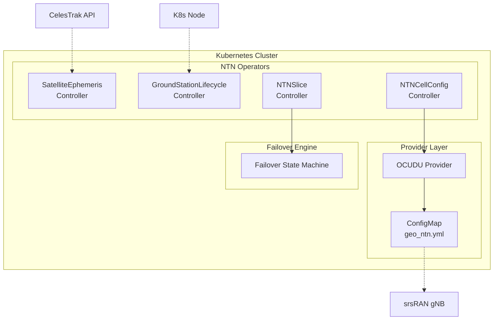

# NTN K8s Operators

[](LICENSE)
[](go.mod)

Kubernetes-native management framework for Non-Terrestrial Networks (NTN). Declaratively manage satellite constellations, ground stations, NTN cell configurations, and terrestrial-satellite failover — all through standard Kubernetes CRDs.

## Custom Resource Definitions

| CRD | Short Name | Description |
|-----|-----------|-------------|
| **SatelliteEphemeris** | `sateph` | Auto-fetches GP data (OMM JSON) from CelesTrak, runs SGP4 pass prediction |
| **GroundStationLifecycle** | `gs` | Manages edge ground station nodes — health checks, firmware, K8s integration |
| **NTNCellConfig** | `ntncc` | Configures NTN gNB cells via OCUDU/srsRAN provider (generates ConfigMap) |
| **NTNSlice** | `nts` | Manages terrestrial-satellite slice failover, QoS mapping, session continuity |

## Architecture



**Provider pattern**: NTNCellConfig uses a pluggable provider interface (currently OCUDU/srsRAN). The provider generates backend-specific config and writes it to a ConfigMap that the gNB pod mounts.

**Failover engine**: NTNSlice evaluates trigger conditions (RSRP, latency, packet loss) and manages terrestrial ↔ satellite path switching with configurable switchback delay.

## Quick Start

### Prerequisites

- Go 1.25+
- Kubernetes cluster (Kind, K3s, or kubeadm)
- kubectl
- Helm v4+ (optional, for Helm-based install)

### Option A: Helm Install

```bash
# Install CRDs
make install

# Deploy via Helm
helm install ntn-operators dist/chart \
  --namespace ntn-operators-system \
  --create-namespace \
  --set crd.enable=false
```

### Option B: One-command Kind Demo

```bash
hack/kind-setup.sh
# Tear down when done:
hack/kind-setup.sh teardown
```

### Option C: Run Locally

```bash
make install    # Install CRDs
make run        # Run controller locally (connects to current kubeconfig)
```

### Apply Sample Resources

```bash
# Satellite constellation tracking
kubectl apply -f config/samples/ntn_v1alpha1_satelliteephemeris.yaml

# Ground station management
kubectl apply -f config/samples/ntn_v1alpha1_groundstationlifecycle.yaml

# NTN cell configuration (OCUDU/srsRAN)
kubectl apply -f config/samples/ntn_v1alpha1_ntncellconfig.yaml

# Terrestrial-satellite slice failover
kubectl apply -f config/samples/ntn_v1alpha1_ntnslice.yaml
```

### Verify

```bash
# Check satellite ephemeris data
kubectl get sateph
# NAME                   SATELLITES   LAST UPDATED   AGE
# oneweb-constellation   651          2m             5m

# Check ground station status
kubectl get gs
# NAME            PHASE          VENDOR     K8S       AGE
# gs-taipei-01    Provisioning   ennoconn   v1.35.1   5m

# Check NTN cell configuration
kubectl get ntncellconfigs
# NAME                PROVIDER   CONFIG MAP               AGE
# ntn-cell-geo-demo   ocudu      ocudu-ntn-ntn-cell-...   5m

# Check NTN slice failover
kubectl get ntnslices
# NAME                         TENANT      ACTIVE PATH   FAILOVERS   AGE
# enterprise-resilient-slice   acme-corp   terrestrial   0           5m

# Inspect generated gNB config
kubectl get configmap ocudu-ntn-ntn-cell-geo-demo -o yaml
```

## Examples

### SatelliteEphemeris

```yaml
apiVersion: ntn.operators.dev/v1alpha1
kind: SatelliteEphemeris
metadata:
  name: oneweb-constellation
spec:
  source:
    type: CelesTrak
    url: https://celestrak.org/NORAD/elements/gp.php?GROUP=oneweb&FORMAT=JSON
    refreshInterval: 4h
  satellites:
    constellation: oneweb
  passPrediction:
    groundStations:
      - gs-taipei-01
    minElevation: "10"
    horizon: 24h
```

### NTNCellConfig

```yaml
apiVersion: ntn.operators.dev/v1alpha1
kind: NTNCellConfig
metadata:
  name: ntn-cell-geo-demo
spec:
  provider:
    type: ocudu
    # namespace is enforced to match metadata.namespace for security
  ntn:
    cellSpecificKoffset: 150
    taCommon: 0
    ephemerisECEF:
      posX: 20922195
      posY: 1967783
      posZ: 19770302
      velX: 0
      velY: 0
      velZ: 0
    payloadType: transparent
```

### NTNSlice

```yaml
apiVersion: ntn.operators.dev/v1alpha1
kind: NTNSlice
metadata:
  name: enterprise-resilient-slice
spec:
  tenant: acme-corp
  terrestrialPath:
    provider: chunghwa-telecom
    priority: primary
  satellitePath:
    provider: oneweb
    ephemerisRef: oneweb-constellation
    priority: failover
  failoverPolicy:
    triggers:
      - "rsrp < -120"
      - "latency > 200"
    switchbackDelay: 60s
    sessionContinuity: true
```

## Development

```bash
make generate   # Generate DeepCopy methods
make manifests  # Generate CRD and RBAC YAML
make test       # Run unit + envtest tests
make lint       # Run golangci-lint
make build      # Build manager binary
```

## Project Structure

```
api/v1alpha1/           # CRD type definitions
internal/controller/    # Reconciler implementations
pkg/ephemeris/          # GP fetcher + SGP4 pass prediction
pkg/provider/ocudu/     # OCUDU/srsRAN provider (config generation)
pkg/slice/              # Failover state machine + trigger parser
pkg/netutil/            # SSRF-safe HTTP client
config/crd/             # Generated CRD YAML
config/samples/         # Sample CR manifests
dist/chart/             # Helm chart
hack/                   # Demo and setup scripts
```

## Contributing

See [CONTRIBUTING.md](CONTRIBUTING.md) for development guidelines.

## License

[Apache License 2.0](LICENSE)
