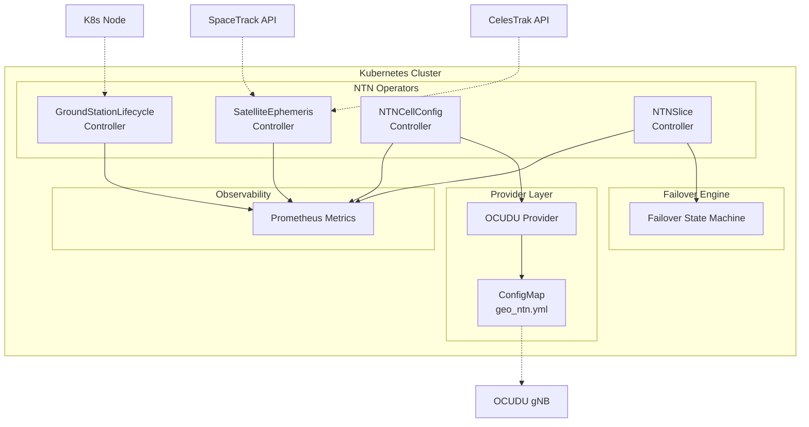

# NTN K8s Operators

[](LICENSE)
[](go.mod)

Kubernetes-native management framework for Non-Terrestrial Networks (NTN). Declaratively manage satellite constellations, ground stations, NTN cell configurations, and terrestrial-satellite failover — all through standard Kubernetes CRDs.

> **Latest release:** [v0.6.0](https://github.com/thc1006/ntn-operators/releases/tag/v0.6.0) — cluster-scope NTN orchestration foundation: gNB-parseable OCUDU config, runtime NTN push (OCUDU !798) with SGP4-propagated ECEF → SIB19, SatelliteEphemeris → multi-NTNCellConfig fan-out with off-cycle epoch freshness, namespace-consistent Prometheus metrics, and Go 1.26.4 (HIGH stdlib CVE fixes). See [CHANGELOG.md](CHANGELOG.md) for the full delta.

## Custom Resource Definitions

| CRD | Short Name | Description |
|-----|-----------|-------------|
| **SatelliteEphemeris** | `sateph` | Auto-fetches GP data (OMM JSON) from CelesTrak or SpaceTrack, runs SGP4 pass prediction |
| **GroundStationLifecycle** | `gs` | Manages edge ground station nodes — health checks, firmware OTA with timeout, K8s integration |
| **NTNCellConfig** | `ntncc` | Configures NTN gNB cells via OCUDU provider (generates ConfigMap with OwnerReference) |
| **NTNSlice** | `nts` | Manages terrestrial-satellite slice failover, QoS mapping, security policy, billing |

## Architecture



**Data sources**: SatelliteEphemeris supports CelesTrak (public, no auth) and SpaceTrack (requires credentials via K8s Secret). Both use the same OMM JSON format parsed by SGP4.

**Orbit regimes (v1.0 SGP4 propagation is LEO-only)**: `SatelliteEphemeris` propagation uses the near-earth SGP4 model. Element sets whose orbital period is ≥ 225 minutes — deep space, roughly MEO and above (e.g. SES O3b, GEO) — are **rejected**, not propagated: the near-earth model would return a silently-wrong position. Rejected sets surface as the `UnsupportedOrbitRegime` status condition plus a Kubernetes event, and are excluded from pass prediction and the runtime ephemeris push; near-earth satellites in the same source are unaffected. The rejection is **scoped to the tracked satellites** — a deep-space bird you exclude via `spec.satellites.noradIDs` will *not* raise the condition. For durable/alertable observability (the event ages out of etcd), watch the condition or the `ntn_operators_gp_deep_space_rejected_count{namespace,ephemeris}` gauge (alert on `> 0`). This limit applies only to **SGP4 propagation**: `NTNCellConfig` still accepts a manually-supplied static GEO `ephemerisECEF` (the v1.1 roadmap item (b) precursor). Multi-orbit (MEO/GEO) support is on the [v1.1 roadmap](#known-limitations): a deep-space SDP4 propagator and/or an externally-managed static-ephemeris path for GEO so GEO links can join slice failover ahead of full SDP4.

**Provider pattern**: NTNCellConfig uses a pluggable provider interface (currently OCUDU). Additional providers may be added in future releases.

**Failover engine**: NTNSlice evaluates trigger conditions (RSRP, latency, packet loss) and manages terrestrial-satellite path switching with configurable switchback delay. QoS, security, and billing parameters are tracked per active path.

**Validation**: CEL `XValidation` rules enforce all constraints at admission — lat/lon range, path priority consistency, MetricsSource shape, ECEF non-zero, credentials when SpaceTrack, and `FailoverPolicy.triggers` syntax. This ships in every install channel (kubectl, Helm, OLM) with no admission webhook and no cert-manager dependency, so malformed input is rejected at create/update time; the failover engine re-validates triggers at runtime as defense in depth.

## Quick Start

### Prerequisites

- Go 1.26+
- Kubernetes 1.31+ (CEL validation, incl. the IP-address library used to validate the gNB remote-control endpoint)
- kubectl
- Helm v3.16+ (optional, for Helm-based install)
- kpt v1.0.0-beta.55+ (optional, for Nephio kpt package install)

### Option A: Helm Install

```bash
# Install CRDs
make install

# Deploy via Helm
helm install ntn-operators dist/chart \
  --namespace ntn-operators-system \
  --create-namespace \
  --set crd.enable=false
```

> **Upgrading (CRD skew).** With `--set crd.enable=false` the CRDs are managed
> out-of-band by `make install`, so `helm upgrade` bumps the operator Deployment
> but **not** the CRDs. Re-run `make install` at the new tag *before* the
> `helm upgrade`:
>
> ```bash
> git checkout vX.Y.Z && make install   # CRDs first, at the new tag
> helm upgrade ntn-operators dist/chart --namespace ntn-operators-system --set crd.enable=false
> ```
>
> Skipping this leaves a new operator running against last release's CRDs; the
> apiserver silently drops fields the old schema doesn't know, so v0.6+ features
> that depend on new spec fields (e.g. the runtime NTN push) go quietly inert.
> To let Helm own the CRD lifecycle instead, install with `--set crd.enable=true`
> (the default) and omit `make install` — then `helm upgrade` updates both
> together.

### Option B: One-command Kind Demo

```bash
hack/kind-setup.sh
# Tear down when done:
hack/kind-setup.sh teardown
```

### Option C: Run Locally

```bash
make install    # Install CRDs
make run        # Run controller locally (connects to current kubeconfig)
```

### Option D: Install via Nephio (kpt package)

ntn-operators ships as a [Nephio](https://nephio.org) R6-compatible kpt package set, with CRDs installed once per cluster as-is (no mutation pipeline).

```bash
kpt pkg get https://github.com/thc1006/ntn-operators.git/nephio/packages/ntn-operators-crds@main ntn-operators-crds
kubectl apply -f ntn-operators-crds/
```

See [`nephio/README.md`](nephio/README.md) for the full quick-start (sibling `ntn-workloads-sample` package, Porch `PackageVariant` example, contributor `make nephio-*` targets) and [ADR 0003](docs/adr/0003-nephio-integration.md) for the design rationale.

### Apply Sample Resources

```bash
# Satellite constellation tracking (CelesTrak)
kubectl apply -f config/samples/ntn_v1alpha1_satelliteephemeris.yaml

# Ground stations (Taipei + Hsinchu)
kubectl apply -f config/samples/ntn_v1alpha1_groundstationlifecycle.yaml
kubectl apply -f config/samples/ntn_v1alpha1_groundstationlifecycle_hsinchu.yaml

# NTN cell configuration (OCUDU)
kubectl apply -f config/samples/ntn_v1alpha1_ntncellconfig.yaml

# Terrestrial-satellite slice failover
kubectl apply -f config/samples/ntn_v1alpha1_ntnslice.yaml
```

### Verify

```bash
# Check satellite ephemeris data
kubectl get sateph
# NAME                   SATELLITES   LAST UPDATED   AGE
# oneweb-constellation   651          2m             5m

# Check ground station status
kubectl get gs
# NAME            PHASE          VENDOR     K8S       AGE
# gs-taipei-01    Provisioning   ennoconn   v1.35.1   5m

# Check NTN cell configuration
kubectl get ntncellconfigs
# NAME                PROVIDER   KOFFSET   PAYLOAD       AGE
# ntn-cell-geo-demo   ocudu      150       transparent   5m

# Check NTN slice failover
kubectl get ntnslices
# NAME                         TENANT      ACTIVE PATH   FAILOVERS   AGE
# enterprise-resilient-slice   acme-corp   terrestrial   0           5m
```

## Examples

### SatelliteEphemeris (CelesTrak)

```yaml
apiVersion: ntn.operators.dev/v1alpha1
kind: SatelliteEphemeris
metadata:
  name: oneweb-constellation
spec:
  source:
    type: CelesTrak
    url: https://celestrak.org/NORAD/elements/gp.php?GROUP=oneweb&FORMAT=JSON
    refreshInterval: 4h
  satellites:
    constellation: oneweb
  passPrediction:
    groundStations:
      - gs-taipei-01
      - gs-hsinchu-01
    minElevation: "10"
    horizon: 24h
```

### NTNCellConfig

```yaml
apiVersion: ntn.operators.dev/v1alpha1
kind: NTNCellConfig
metadata:
  name: ntn-cell-geo-demo
spec:
  provider:
    type: ocudu
  ntn:
    cellSpecificKoffset: 150
    ephemerisECEF:
      posX: 20922195
      posY: 1967783
      posZ: 19770302
      velX: 0
      velY: 0
      velZ: 0
    payloadType: transparent
```

### NTNSlice

```yaml
apiVersion: ntn.operators.dev/v1alpha1
kind: NTNSlice
metadata:
  name: enterprise-resilient-slice
spec:
  tenant: acme-corp
  terrestrialPath:
    provider: chunghwa-telecom
    priority: primary
  satellitePath:
    provider: oneweb
    ephemerisRef: oneweb-constellation
    priority: failover
  failoverPolicy:
    triggers:
      - "rsrp < -120"
      - "latency > 200"
    switchbackDelay: 60s
    sessionContinuity: true
  qosMapping:
    terrestrial5QI: 9
    satelliteQCI: best-effort
  security:
    encryptionLevel: AES-256
    authOnHandover: re-authenticate
```

## Observability

### Prometheus Metrics

The operator exports custom metrics at `:8443/metrics`:

| Metric | Type | Description |
|--------|------|-------------|
| `ntn_operators_failover_total` | Counter | Failover events by slice, source/target path |
| `ntn_operators_satellite_pass_available` | Gauge | Satellite pass window active (1/0) |
| `ntn_operators_ground_station_health` | Gauge | Station condition status (1/0/-1) |
| `ntn_operators_config_apply_errors_total` | Counter | Cell config apply failures |
| `ntn_operators_gp_fetch_duration_seconds` | Histogram | GP data fetch duration |
| `ntn_operators_gp_satellite_count` | Gauge | Satellites from latest fetch |
| `ntn_operators_reader_query_duration_seconds` | Histogram | Per-query metrics reader latency, by source + outcome |
| `ntn_operators_reader_errors_total` | Counter | Metrics-reader failures, by source + reason |
| `ntn_operators_reader_stale_value_used_total` | Counter | Reconciles served from the stale cache, per slice |

## SpaceTrack Integration

To use SpaceTrack as a data source, create a Secret with your credentials:

```yaml
apiVersion: v1
kind: Secret
metadata:
  name: spacetrack-creds
type: Opaque
stringData:
  username: your-spacetrack-username
  password: your-spacetrack-password
```

Then reference it in the SatelliteEphemeris:

```yaml
apiVersion: ntn.operators.dev/v1alpha1
kind: SatelliteEphemeris
metadata:
  name: oneweb-spacetrack
spec:
  source:
    type: SpaceTrack
    url: https://www.space-track.org/basicspacedata/query/class/gp/GROUP/oneweb/format/json
    refreshInterval: 4h
    credentials:
      name: spacetrack-creds
      key: password
```

## Development

```bash
make generate   # Generate DeepCopy methods
make manifests  # Generate CRD and RBAC YAML
make test       # Run unit + envtest tests
make lint       # Run golangci-lint
make build      # Build manager binary
make docs       # Generate API reference from CRDs
make ko-build   # Build container image with ko (local)
make ko-push    # Build and push multi-arch image
make test-e2e   # Run E2E tests on Kind cluster
```

## Project Structure

```
api/v1alpha1/           # CRD type definitions (with CEL validation rules)
internal/controller/    # Reconciler implementations
pkg/ephemeris/          # CelesTrak + SpaceTrack GP fetchers, SGP4 pass prediction
pkg/provider/ocudu/     # OCUDU provider (config generation)
pkg/slice/              # Failover state machine + trigger parser
pkg/netutil/            # SSRF-safe HTTP client
pkg/metrics/            # Custom Prometheus metrics
config/crd/             # Generated CRD YAML
config/samples/         # Sample CR manifests
dist/chart/             # Helm chart
hack/                   # Demo and setup scripts
docs/                   # API reference (auto-generated)
```

## Known Limitations

- **Antenna health**: `AntennaReady` is still simulated as True when the node exists; real hardware agents are tracked for v1.0 ([#68](https://github.com/thc1006/ntn-operators/issues/68)).
- **Session continuity**: The `sessionContinuity` spec field is tracked but not yet enforced at the data plane — paused ([#69](https://github.com/thc1006/ntn-operators/issues/69)).
- **Providers**: Only OCUDU is implemented; OAI gNB support is tracked for v1.0 ([#65](https://github.com/thc1006/ntn-operators/issues/65)).
- **Firmware updates**: The controller monitors node annotations for firmware versions but does not directly trigger OTA. An external agent on the node manages the actual update.
- **Metrics source**: `spec.metricsSource.type=annotations` (or omitting the `metricsSource` block entirely) is the default for backward compatibility. Production deployments should set `spec.metricsSource.type=prometheus` — see `config/samples/ntn_v1alpha1_ntnslice_prometheus.yaml` for a copy-pasteable example and the CHANGELOG for the pluggable reader layer shipped in #67.
- **Orbit regimes — LEO only (v1.0)**: propagation uses the near-earth SGP4 model, so element sets with an orbital period ≥ 225 min (deep space: MEO/GEO — e.g. SES O3b ~288 min, GEO ~1436 min) are rejected via the `UnsupportedOrbitRegime` condition rather than propagated into a silently-wrong position (the bundled propagator has no SDP4 branch). Multi-orbit support is the **v1.1** first priority, sequenced as: **(a)** adopt a deep-space **SDP4** propagator for Go — acceptance is passing Vallado's `SGP4-VER.TLE` verification cases including the deep-space vectors; **(b)** an externally-managed / static-ephemeris path for GEO that bypasses the propagator, letting GEO links join slice failover before SDP4 lands. Which lands first is decided with design partners.

## Grafana Dashboard

Import `config/grafana/ntn-operators-dashboard.json` into your Grafana instance to visualize 9 custom metrics (failover events, satellite pass availability, ground station health, GP fetch duration, satellite count, config-apply errors, reader errors, reader query duration, stale-read usage).

## API Reference

See [docs/api-reference.md](docs/api-reference.md) for the complete CRD field reference.

## Contributing

See [CONTRIBUTING.md](CONTRIBUTING.md) for development guidelines.

## License

[Apache License 2.0](LICENSE)
