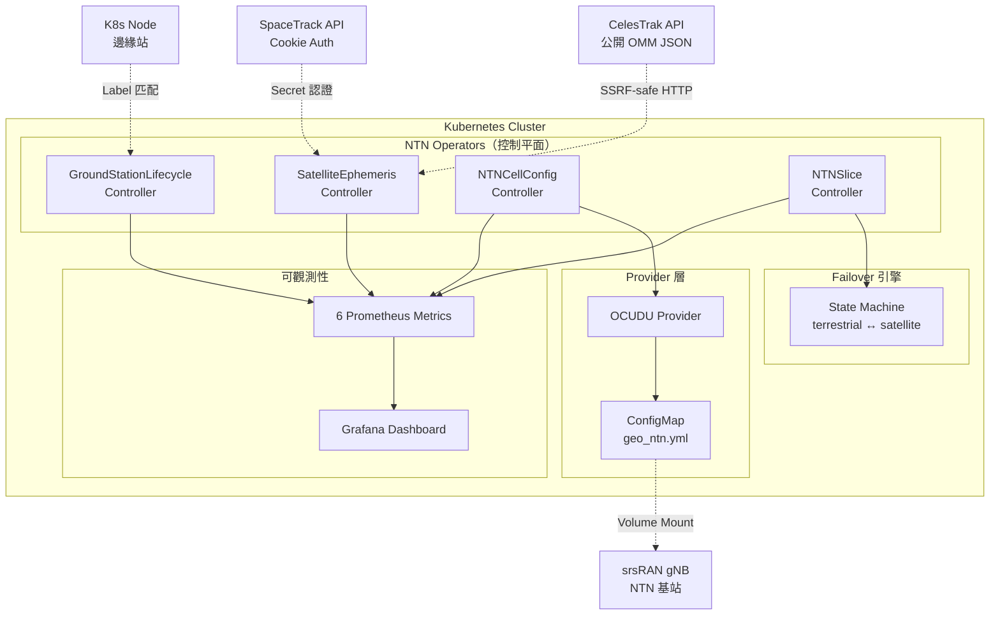

# NTN K8s Operators 技術白皮書

**全球首個 Non-Terrestrial Network Kubernetes Operator**

版本：v0.1.0 | 日期：2026 年 4 月 | 作者：蔡秀吉 (Hsiu-Chi Tsai)

---

## 目錄

1. [執行摘要](#1-執行摘要)
2. [問題定義與市場缺口](#2-問題定義與市場缺口)
3. [解決方案概述](#3-解決方案概述)
4. [系統架構](#4-系統架構)
5. [四個 CRD 詳細設計](#5-四個-crd-詳細設計)
6. [Provider 抽象層](#6-provider-抽象層)
7. [Failover 引擎](#7-failover-引擎)
8. [安全架構](#8-安全架構)
9. [可觀測性](#9-可觀測性)
10. [部署與維運](#10-部署與維運)
11. [測試與品質](#11-測試與品質)
12. [技術規格總覽](#12-技術規格總覽)
13. [與合作夥伴的整合場景](#13-與合作夥伴的整合場景)
14. [技術路線圖](#14-技術路線圖)
15. [附錄](#15-附錄)

---

## 1. 執行摘要

### 1.1 專案定位

NTN K8s Operators 是**全球第一個**以 Kubernetes Operator Pattern 實作的非地面網路（Non-Terrestrial Network, NTN）管理框架。經過 GitHub、GitLab、OperatorHub.io、ArtifactHub、CNCF Landscape、Nephio 全組織搜索驗證，截至 2026 年 4 月，**全球不存在任何 NTN Kubernetes CRD 或 Operator**。

### 1.2 核心價值

| 維度 | 傳統方案 | NTN K8s Operators |
|------|---------|-------------------|
| 管理介面 | 廠商私有 API（Aalyria gRPC、ST Engineering CLI） | 標準 Kubernetes CRD（kubectl / GitOps） |
| 自動化 | 手動腳本或專用控制台 | 宣告式 Reconciliation Loop（自我修復） |
| 可觀測性 | 廠商儀表板 | Prometheus + Grafana（雲原生標準） |
| 多廠商 | 每個廠商一套工具 | 統一 Provider Interface（插拔式） |
| 部署 | VM 或 bare-metal | Helm chart + ko 容器映像（multi-arch） |

### 1.3 關鍵數據

- **4 個 CRD**、4 個 Controller、2 個 GP 資料源、1 個 Provider、1 個 Failover 引擎
- **4,138 行** Go 生產程式碼 + **4,379 行**測試程式碼
- **78 個**自動化測試、**84.5%+** 程式碼覆蓋率
- **7 條** CEL 驗證規則（零 webhook 基礎設施）
- **6 個**自定義 Prometheus 指標
- Apache 2.0 開源授權，目標 CNCF Sandbox

---

## 2. 問題定義與市場缺口

### 2.1 NTN 產業現況

3GPP Release 17（2022）首次將衛星整合進 5G NR 標準。Release 19（2025 年 12 月凍結）進一步支持：

- **再生式酬載**（gNB-on-satellite）
- **星際鏈路**（ISL via Xn interface）
- **波束管理**強化
- **NB-IoT NTN** 衛星 TDD 頻段

商用進展迅速：SpaceX/T-Mobile Direct-to-Cell（2025 年 7 月商用）、AST SpaceMobile（2026 年商用）。

### 2.2 現有平台的局限

| 平台 | 組織 | 限制 |
|------|------|------|
| Aalyria Spacetime | Google 分拆 | gRPC 私有 API，無 K8s CRD |
| ST Engineering iDirect | ST Engineering | 專用控制台，無開源 |
| Gilat SkyEdge IV | Gilat | VSAT 專用，非雲原生 |
| srsRAN/OCUDU | SRS / OCUDU | 命令列 YAML 配置，無 Operator |

### 2.3 缺口驗證

全球搜索（2026 年 4 月驗證）：

- GitHub：`ntn kubernetes operator` → 0 結果
- OperatorHub.io：`satellite` → 0 結果
- ArtifactHub：`ntn` → 0 結果
- CNCF Landscape：無 NTN 類別
- Nephio R3：無 NTN 工作項目

**結論：NTN K8s CRDs = 全球空白，first mover 定義 API 規範。**

### 2.4 為何用 Kubernetes Operator？

電信業已廣泛採用 K8s 管理 5G 核心網路：

- **Nephio**（CNCF/Linux Foundation）：5G NF 自動化
- **Open5GS Operator**：5GC 部署
- **ONAP/OSM**：NFV 編排

但**衛星-地面整合**仍停留在腳本和手動配置。Operator Pattern 提供：

1. **宣告式管理**：描述期望狀態，Controller 自動 reconcile
2. **自我修復**：衛星失聯 → 自動 failover → 恢復後 switchback
3. **GitOps 相容**：所有配置是 YAML，ArgoCD/Flux 直接部署
4. **標準可觀測性**：Prometheus/Grafana 一套工具監控所有 CRD

---

## 3. 解決方案概述

### 3.1 CRD 概覽

```
┌─────────────────────────────────────────────────────┐
│                  NTN K8s Operators                    │
│                                                       │
│  ┌──────────────┐  ┌──────────────────────────────┐  │
│  │ SatelliteEph │  │ GroundStationLifecycle        │  │
│  │ emeris       │  │                                │  │
│  │              │  │ • Node 匹配 + 健康檢查         │  │
│  │ • CelesTrak  │  │ • 韌體 OTA + 超時保護         │  │
│  │ • SpaceTrack │  │ • K8s 版本追蹤                 │  │
│  │ • SGP4 預測  │  │                                │  │
│  └──────┬───────┘  └──────────────────────────────┘  │
│         │                                             │
│  ┌──────┴───────┐  ┌──────────────────────────────┐  │
│  │ NTNSlice     │  │ NTNCellConfig                 │  │
│  │              │  │                                │  │
│  │ • Failover   │  │ • OCUDU Provider              │  │
│  │ • QoS 映射   │  │ • ConfigMap 生成              │  │
│  │ • 安全策略   │  │ • OwnerReference GC           │  │
│  │ • 計費模式   │  │ • Finalizer 清理              │  │
│  └──────────────┘  └──────────────────────────────┘  │
└─────────────────────────────────────────────────────┘
```

### 3.2 設計原則

1. **宣告式**（Declarative）：用戶描述期望狀態，Controller 負責達成
2. **Provider 無關**（Provider-agnostic）：同一 CRD 支持不同 NTN 後端
3. **CEL 驗證**（Server-side）：CRD 層級驗證，無需 webhook 基礎設施
4. **可觀測**（Observable）：自定義 Prometheus 指標覆蓋所有領域事件
5. **安全優先**（Secure by default）：SSRF 防護、namespace 隔離、Secret 管理
6. **GitOps 就緒**（GitOps-ready）：所有配置是 YAML，ArgoCD/Flux 友善

---

## 4. 系統架構

### 4.1 架構圖



### 4.2 資料流

```
1. SatelliteEphemeris Controller
   ├─ 每 4 小時從 CelesTrak/SpaceTrack 取得 GP 資料（OMM JSON）
   ├─ 用 SGP4 演算法計算 pass prediction（最多 500 個 pass windows）
   └─ 更新 Status：satelliteCount, lastUpdated, nextPassWindows

2. GroundStationLifecycle Controller
   ├─ 透過 Node Label 匹配地面站
   ├─ 讀取 K8s Node 狀態（Ready/NotReady, version）
   ├─ HTTP 健康檢查（可選）
   └─ 韌體 OTA 管理（觸發 → 等待 agent 確認 → 超時保護）

3. NTNCellConfig Controller
   ├─ 讀取 NTN 參數（koffset, TA, ECEF 座標, payload type）
   ├─ 透過 OCUDU Provider 生成 srsRAN 相容 YAML
   ├─ 寫入 ConfigMap（帶 OwnerReference）
   └─ Finalizer 確保刪除時清理 ConfigMap

4. NTNSlice Controller
   ├─ 讀取 metrics（annotation-based，v0.2 將整合 Prometheus）
   ├─ 查詢 SatelliteEphemeris 的 pass windows
   ├─ Failover 引擎決策（stay / failover / switchback）
   ├─ 更新 QoS/Security/Billing 狀態
   └─ 發送 Prometheus metrics + K8s Events
```

### 4.3 技術堆疊

| 層級 | 技術 |
|------|------|
| 語言 | Go 1.25 |
| 框架 | kubebuilder v4.13.1 + controller-runtime v0.23.3 |
| 軌道計算 | akhenakh/sgp4（Pure Go，Apache 2.0） |
| 驗證 | CEL x-kubernetes-validations（K8s 1.29+ GA） |
| 容器 | ko-build/ko（distroless/static:nonroot） |
| 部署 | Helm chart + kustomize |
| CI/CD | GitHub Actions（lint + test + e2e + chart + release） |
| 監控 | Prometheus + Grafana |

---

## 5. 四個 CRD 詳細設計

### 5.1 SatelliteEphemeris

**用途**：自動追蹤衛星星系軌道資料，計算衛星過站時間窗口。

**Spec 欄位**：

| 欄位 | 說明 | 範例 |
|------|------|------|
| `source.type` | 資料源類型 | `CelesTrak` 或 `SpaceTrack` |
| `source.url` | GP 資料端點 URL | `https://celestrak.org/NORAD/elements/gp.php?GROUP=oneweb&FORMAT=JSON` |
| `source.refreshInterval` | 更新頻率（最低 2 小時） | `4h` |
| `source.credentials` | SpaceTrack 認證 Secret 參考 | `{name: "st-creds", key: "password"}` |
| `satellites.constellation` | 星系過濾 | `oneweb` |
| `passPrediction.groundStations` | 地面站清單 | `["gs-taipei-01", "gs-hsinchu-01"]` |
| `passPrediction.minElevation` | 最低仰角（度） | `"10"` |
| `passPrediction.horizon` | 預測窗口 | `24h` |

**Status 欄位**：

| 欄位 | 說明 |
|------|------|
| `satelliteCount` | 追蹤的衛星數量 |
| `lastUpdated` | 最後一次成功取得 GP 資料的時間 |
| `nextPassWindows[]` | 預計過站窗口清單（最多 500 個） |
| `conditions` | GPDataFetched, GPDataParsed, PassesPredicted |

**CEL 驗證規則**：
- SpaceTrack 類型必須提供 credentials
- URL 必須是 `https://` 開頭

**GP 資料流**：

```
CelesTrak/SpaceTrack → HTTP GET（ETag 快取）→ OMM JSON
→ sgp4.ParseOMMs() → []sgp4.OMM
→ SGP4 Propagator → 對每個衛星 × 每個地面站計算 pass window
→ 寫入 Status.NextPassWindows
```

**SpaceTrack 認證流程**：

```
1. Controller 從 K8s Secret 讀取 username/password
2. POST /ajaxauth/login → 取得 session cookie
3. GET /basicspacedata/query/class/gp/... → OMM JSON
4. Cookie 自動重用（session reuse）
5. HTTP 401 → 自動 re-login 一次
6. 30 req/min rate limit 保護
```

### 5.2 GroundStationLifecycle

**用途**：管理衛星地面站邊緣節點的完整生命週期。

**Spec 欄位**：

| 欄位 | 說明 | 範例 |
|------|------|------|
| `hardware.vendor` | 硬體廠商 | `ennoconn`（樺漢） |
| `hardware.model` | 型號 | `rugged-edge-5000` |
| `hardware.antennaType` | 天線類型 | `flat-panel` |
| `hardware.bands[]` | 頻段 | `["Ka", "Ku"]` |
| `deployment.location.lat/lon/alt` | 地理座標 | `"25.0330"`, `"121.5654"`, `"15"` |
| `deployment.k8sDistro` | 邊緣 K8s 發行版 | `k3s` / `microk8s` / `rke2` |
| `monitoring.healthCheckInterval` | 健康檢查頻率 | `30s` |
| `monitoring.endpoint` | HTTP 健康端點 | `http://10.0.0.1:8080/health` |
| `firmware.autoUpdate` | 自動韌體更新 | `true` |
| `firmware.channel` | 更新頻道 | `stable` |
| `firmware.maintenanceWindow` | 維護窗口 | `"02:00-04:00 UTC"` |

**Phase 狀態機**：

```
Provisioning → Running → Updating → Running
                  ↓          ↓
              Degraded   Degraded（超時 30min）
                  ↓
               Offline
```

**Node 匹配機制**：

```
Node Label: ntn.operators.dev/groundstation=<namespace>.<name>
→ Controller 透過 Label Selector 找到匹配的 Node
→ 讀取 Node conditions（Ready/NotReady）
→ 讀取 Node annotations（firmware-version, available-firmware-version）
```

**韌體更新流程**：

```
1. Node annotation 報告：firmware-version=1.0, available-firmware-version=1.1
2. Controller 偵測 1.0 ≠ 1.1 且 autoUpdate=true
3. 檢查 maintenanceWindow（在窗口內才觸發）
4. Phase → Updating, 記錄 firmwareUpdateStarted 時間
5. 等待 Node agent 更新 firmware-version annotation 為 1.1
6. firmware-version=1.1 → Phase → Running, UpdateCompleted
7. 如果超過 30 分鐘 agent 未回報 → Phase → Degraded, UpdateTimedOut
```

**CEL 驗證規則**：
- 緯度範圍 [-90, 90]
- 經度範圍 [-180, 180]

### 5.3 NTNCellConfig

**用途**：管理 NTN gNB（基站）的 cell configuration。

**Spec 欄位**：

| 欄位 | 說明 | 範例 |
|------|------|------|
| `provider.type` | Provider 類型 | `ocudu`（v0.2: `oai`, `aalyria`） |
| `ntn.cellSpecificKoffset` | Cell-specific k-offset (0-1023) | `150` |
| `ntn.taCommon` | Common Timing Advance | `0` |
| `ntn.ephemerisECEF.posX/Y/Z` | 衛星 ECEF 位置 | `20922195`, `1967783`, `19770302` |
| `ntn.ephemerisECEF.velX/Y/Z` | 衛星 ECEF 速度 | `0` (GEO) |
| `ntn.payloadType` | 酬載類型 | `transparent` / `regenerative` |

**ConfigMap 生成範例**（srsRAN/OCUDU 格式）：

```yaml
# Generated by NTN K8s Operators
ntn:
  cell_specific_koffset: 150
  ta_info:
    ta_common: 0
  ephemeris_info_ecef:
    pos_x: 20922195
    pos_y: 1967783
    pos_z: 19770302
    vel_x: 0
    vel_y: 0
    vel_z: 0
```

**資源管理**：
- ConfigMap 命名：`ocudu-ntn-<CR name>`（per-CR 隔離）
- OwnerReference：ConfigMap 指向 NTNCellConfig（K8s GC）
- Finalizer：刪除 CR 時先清理 ConfigMap

**CEL 驗證規則**：
- ECEF 位置不能全為零

### 5.4 NTNSlice

**用途**：管理地面-衛星網路切片的 failover、QoS、安全、計費。

**Spec 欄位**：

| 欄位 | 說明 | 範例 |
|------|------|------|
| `tenant` | 租戶 | `acme-corp` |
| `terrestrialPath.provider` | 地面網路供應商 | `chunghwa-telecom` |
| `terrestrialPath.priority` | 優先級 | `primary` |
| `satellitePath.provider` | 衛星供應商 | `oneweb` |
| `satellitePath.ephemerisRef` | 對應的 SatelliteEphemeris | `oneweb-constellation` |
| `satellitePath.priority` | 優先級 | `failover` |
| `failoverPolicy.triggers[]` | 觸發條件（OR 邏輯） | `["rsrp < -120", "latency > 200"]` |
| `failoverPolicy.switchbackDelay` | 回切延遲 | `60s` |
| `qosMapping.terrestrial5QI` | 地面 5G QoS ID | `9` |
| `qosMapping.satelliteQCI` | 衛星 QoS class | `best-effort` |
| `security.encryptionLevel` | 加密標準 | `AES-256` |
| `security.authOnHandover` | 切換時認證 | `re-authenticate` |
| `billing.terrestrialRate` | 地面計費模式 | `per-volume` |
| `billing.satelliteRate` | 衛星計費模式 | `per-minute` |

**Status 欄位**：

| 欄位 | 說明 |
|------|------|
| `activePathType` | 當前路徑：`terrestrial` / `satellite` / `unavailable` |
| `failoverCount` | 累計 failover 次數 |
| `lastFailover` | 最後一次 failover 時間 |
| `appliedQoS` | 生效中的 QoS 設定 |
| `appliedEncryption` | 生效中的加密等級 |
| `billingMode` | 生效中的計費模式 |
| `conditions` | PathActive, FailoverReady, QoSApplied, Secured, BillingActive |

**CEL 驗證規則**：
- `terrestrialPath.priority` 必須是 `primary`
- `satellitePath.priority` 必須是 `failover`
- `triggers` 最多 10 個

---

## 6. Provider 抽象層

### 6.1 Interface 設計

```go
type NTNProvider interface {
    ApplyCellConfig(ctx context.Context, crName string, spec *NTNCellConfigSpec) error
    GetCellStatus(ctx context.Context, crName, namespace string) (*NTNCellConfigStatus, error)
}
```

### 6.2 已實作：OCUDU/srsRAN Provider

- 讀取 NTNCellConfig spec
- 用 Go template 生成 srsRAN 相容 YAML（`geo_ntn.yml`）
- 寫入 K8s ConfigMap（gNB Pod 透過 Volume Mount 讀取）
- 已驗證：srsRAN gNB commit 4bf1543（ZMQ 模式，NGAP 建立成功）

### 6.3 計劃中（v0.2）

| Provider | 格式 | 介面 |
|----------|------|------|
| OAI | libconfig | Helm values overlay |
| Aalyria | Protocol Buffers | gRPC NBI API v20.3 |

---

## 7. Failover 引擎

### 7.1 狀態機

```
                    trigger 觸發 + satellite 可用
          ┌────────────────────────────────────────┐
          │                                        ↓
    ┌───────────┐                          ┌──────────────┐
    │terrestrial│                          │  satellite   │
    └───────────┘                          └──────────────┘
          ↑                                        │
          │    terrestrial 恢復 + switchback delay  │
          └────────────────────────────────────────┘
                    elapsed                    
                                               │
                                        satellite pass 結束
                                               ↓
                                    強制回切 terrestrial
```

### 7.2 決策邏輯

```
INPUT: currentPath, triggers[], metrics, satelliteAvailable, switchbackDelay, lastFailover, now

1. Parse 所有 triggers（OR 邏輯）
2. 判斷是否有 trigger 被觸發

SWITCH currentPath:
  terrestrial:
    - 無 trigger → STAY（地面健康）
    - 有 trigger + 衛星不可用 → STAY（無替代路徑）
    - 有 trigger + 衛星可用 → FAILOVER

  satellite:
    - 衛星 pass 結束 → SWITCHBACK（強制）
    - 地面仍劣化 → STAY
    - 地面恢復 + delay 未到 → STAY（防抖動）
    - 地面恢復 + delay 已到 → SWITCHBACK

  unavailable:
    - 地面恢復 → SWITCHBACK → terrestrial
    - 衛星可用 → FAILOVER → satellite
    - 兩者皆不可用 → STAY unavailable
```

### 7.3 Trigger 支持的 Metrics

| Metric | 別名 | 單位 | 範例 |
|--------|------|------|------|
| `rsrp` | `terrestrialRSRP` | dBm | `rsrp < -120` |
| `latency` | `terrestrialLatency` | ms | `latency > 200` |
| `packetLoss` | `terrestrialPacketLoss` | % | `packetLoss > 5` |

### 7.4 QoS/Billing 路徑切換

Failover 時自動切換：

| 項目 | Terrestrial | Satellite |
|------|-------------|-----------|
| QoS | `5QI=9` | `QCI=best-effort` |
| Billing | `per-volume` | `per-minute` |
| Encryption | `AES-256`（不變） | `AES-256`（不變） |

---

## 8. 安全架構

### 8.1 SSRF 防護

所有外部 HTTP 請求（CelesTrak、SpaceTrack、地面站健康檢查）經過 `pkg/netutil/SafeHTTPClient`：

- **TCP dial 層級** IP 驗證（非 URL 層級，防 DNS rebinding）
- 拒絕：RFC 1918、loopback、link-local、cloud metadata（169.254.169.254）
- 重導目標也驗證（defense in depth）
- 基於 `http.DefaultTransport.Clone()`，保留 proxy 和連線池

### 8.2 Namespace 隔離

- NTNCellConfig controller 強制 `provider.namespace = CR namespace`
- 無論使用者設定什麼，ConfigMap 只寫入 CR 所在 namespace
- 防止 confused deputy 攻擊

### 8.3 CEL 驗證

7 條 CRD 層級驗證規則，K8s API server 直接 enforce：

1. SpaceTrack 必須有 credentials
2. URL 必須 `https://`
3. 緯度 [-90, 90]
4. 經度 [-180, 180]
5. ECEF 位置不能全零
6. terrestrialPath.priority 必須 `primary`
7. satellitePath.priority 必須 `failover`

### 8.4 Secret 管理

- SpaceTrack credentials 存在 K8s Secret
- Controller RBAC：`secrets:get;list;watch`
- Secret 只在 reconcile 時讀取，不快取在記憶體

### 8.5 容器安全

- Base image：`gcr.io/distroless/static:nonroot`
- `runAsUser: 65532`, `runAsGroup: 65532`
- `readOnlyRootFilesystem: true`
- `allowPrivilegeEscalation: false`
- `capabilities.drop: ALL`
- `seccompProfile: RuntimeDefault`

---

## 9. 可觀測性

### 9.1 Prometheus 指標

| 指標名稱 | 類型 | 說明 |
|----------|------|------|
| `ntn_operators_failover_total` | Counter | Failover 事件（by slice, from/to path） |
| `ntn_operators_satellite_pass_available` | Gauge | 衛星 pass 是否可用（1/0） |
| `ntn_operators_ground_station_health` | Gauge | 地面站健康（1=True, 0=False, -1=Unknown） |
| `ntn_operators_config_apply_errors_total` | Counter | Cell config 套用錯誤 |
| `ntn_operators_gp_fetch_duration_seconds` | Histogram | GP 資料取得耗時（0.5-60s buckets） |
| `ntn_operators_gp_satellite_count` | Gauge | 追蹤的衛星數量 |

### 9.2 Grafana Dashboard

提供 6 面板的 JSON dashboard（`config/grafana/ntn-operators-dashboard.json`）：

1. Failover Events（時間序列）
2. Satellite Pass Availability（狀態燈）
3. Ground Station Health（表格）
4. GP Fetch Duration（p50/p95/p99 百分位）
5. Satellite Count（數值）
6. Config Apply Errors（時間序列）

### 9.3 Kubernetes Events

每個 Controller 在關鍵狀態變更時產生 K8s Events：

- `GPDataFetched`：成功取得 GP 資料
- `FailoverTriggered`：Failover 觸發
- `Switchback`：回切地面路徑
- `FirmwareUpdateStarted` / `FirmwareUpdated` / `FirmwareUpdateTimedOut`
- `ConfigApplied` / `ApplyFailed`

---

## 10. 部署與維運

### 10.1 Helm 安裝

```bash
# 安裝 CRDs
make install

# 部署 Operator
helm install ntn-operators dist/chart \
  --namespace ntn-operators-system \
  --create-namespace \
  --set crd.enable=false
```

### 10.2 ko 容器建置

```bash
# 本地建置（單架構）
make ko-build

# 推送到 ghcr.io（多架構 amd64+arm64）
make ko-push
```

### 10.3 Release Pipeline

```
git tag v0.1.0 && git push origin v0.1.0
→ GitHub Actions 觸發
→ ko build --platform=linux/amd64,linux/arm64
→ Push to ghcr.io/thc1006/ntn-operators:v0.1.0
→ helm package + helm push oci://
→ GitHub Release 自動建立
```

### 10.4 高可用性

- Leader Election：預設啟用（`--leader-elect=true`）
- PodDisruptionBudget：Helm chart 可選啟用
- 多副本支持：透過 `manager.replicas` 設定

---

## 11. 測試與品質

### 11.1 測試矩陣

| 層級 | 數量 | 工具 | 覆蓋範圍 |
|------|------|------|----------|
| 單元測試 | 78 | Go testing + Ginkgo | 函式級別 |
| envtest | 包含在上述 | controller-runtime envtest | Controller + CRD |
| E2E | 5 | Kind + kubectl | 完整流程 |
| Helm | 1 | Kind + Helm deploy | Chart 安裝 |
| Lint | 1 | golangci-lint v2.8 | 程式碼品質 |

### 11.2 覆蓋率

| 套件 | 覆蓋率 |
|------|--------|
| internal/controller | 84.5% |
| pkg/ephemeris | 91.0% |
| pkg/lifecycle | 95.5% |
| pkg/metrics | 100.0% |
| pkg/provider/ocudu | 81.2% |
| pkg/slice | 82.1% |
| pkg/netutil | 69.0% |

### 11.3 CI/CD Pipeline

```
Push to main / PR:
├─ Lint (golangci-lint) ─── path filter: **.go
├─ Tests (envtest) ──────── path filter: **.go, CRD
├─ E2E (Kind cluster) ──── path filter: internal/, pkg/, test/
└─ Chart (Helm deploy) ─── path filter: dist/chart/, CRD

Tag v*:
└─ Release (ko + Helm OCI + GitHub Release)
```

---

## 12. 技術規格總覽

| 項目 | 數值 |
|------|------|
| 程式語言 | Go 1.25 |
| 生產程式碼 | 4,138 行 |
| 測試程式碼 | 4,379 行 |
| 測試數量 | 78 |
| CRD 數量 | 4 |
| CRD 欄位總數 | 185 |
| CEL 驗證規則 | 7 |
| Prometheus 指標 | 6 |
| Controller | 4 |
| Provider | 1（OCUDU） |
| GP 資料源 | 2（CelesTrak + SpaceTrack） |
| Helm chart templates | 32 |
| CI workflows | 5 |
| Git commits | 74 |
| 檔案數量 | 152 |
| 授權 | Apache 2.0 |
| 容器架構 | amd64 + arm64 |
| 最低 K8s 版本 | 1.29（CEL validation GA） |

---

## 13. 與合作夥伴的整合場景

### 13.1 樺漢科技（Ennoconn）— NTN 邊緣硬體

**整合點**：GroundStationLifecycle CRD

```yaml
apiVersion: ntn.operators.dev/v1alpha1
kind: GroundStationLifecycle
metadata:
  name: gs-taipei-01
spec:
  hardware:
    vendor: ennoconn              # 樺漢硬體
    model: rugged-edge-5000       # 強固型邊緣運算平台
    antennaType: flat-panel
    bands: ["Ka", "Ku"]
  deployment:
    location:
      lat: "25.0330"              # 台北
      lon: "121.5654"
    k8sDistro: k3s                # 邊緣 K8s
  firmware:
    autoUpdate: true
    maintenanceWindow: "02:00-04:00 UTC"
```

**價值**：
- 樺漢邊緣平台 + K3s 部署，透過 CRD 統一管理
- 韌體 OTA 自動化（含超時保護）
- 健康監控 + Prometheus 指標匯入企業監控平台

### 13.2 零壹科技 — 企業 IT 通路

**整合點**：NTNSlice CRD（企業韌性通訊）

```yaml
apiVersion: ntn.operators.dev/v1alpha1
kind: NTNSlice
metadata:
  name: enterprise-resilient-slice
spec:
  tenant: customer-enterprise      # 零壹客戶
  terrestrialPath:
    provider: chunghwa-telecom
    priority: primary
  satellitePath:
    provider: oneweb
    ephemerisRef: oneweb-constellation
    priority: failover
  failoverPolicy:
    triggers:
      - "rsrp < -120"
      - "latency > 200"
    switchbackDelay: 60s
  qosMapping:
    terrestrial5QI: 9
    satelliteQCI: best-effort
  security:
    encryptionLevel: AES-256
  billing:
    terrestrialRate: per-volume
    satelliteRate: per-minute
```

**價值**：
- 企業客戶一鍵啟用地面-衛星韌性通訊
- 自動 failover（地面網路斷線 → 衛星接管）
- 可計費：不同路徑不同計費模式
- 安全：切換時自動重新認證

### 13.3 台本基金 — 投資

**價值主張**：
- 全球唯一 NTN K8s Operator（first mover advantage）
- Apache 2.0 開源 → CNCF Sandbox → 產業標準化
- 收入模式：SBIR Phase 1 → 企業諮詢 → Open Core

---

## 14. 技術路線圖

### v0.1.0（2026 年 4 月）— 已完成 ✅

- 4 CRD + 4 Controller
- CelesTrak + SpaceTrack GP fetcher
- OCUDU/srsRAN Provider
- Failover 引擎 + QoS/Security/Billing
- CEL 驗證 + SSRF 防護
- Prometheus 指標 + Grafana dashboard
- Helm chart + ko release pipeline
- 78 tests, 84.5% coverage

### v0.2.0（2026 年 Q3）— 計劃中

- OAI gNB Provider
- Aalyria Spacetime gRPC Provider
- Prometheus/UPF 真實 metrics 整合（取代 annotation）
- Validating Webhook（CRD reference 存在性）
- Multi-cluster SatelliteEphemeris 同步
- Grafana alerting rules

### v0.3.0（2026 年 Q4）— 計劃中

- CNCF Sandbox 申請
- OpenSSF Best Practices Badge
- Traffic steering（split-load, per-flow）
- Session continuity enforcement
- 3GPP Release 19 regenerative payload 支持

---

## 15. 附錄

### 15.1 術語表

| 術語 | 說明 |
|------|------|
| NTN | Non-Terrestrial Network，非地面網路 |
| CRD | Custom Resource Definition，K8s 自定義資源 |
| GP | General Perturbations，軌道參數 |
| OMM | Orbit Mean-Elements Message，軌道平均元素訊息 |
| SGP4 | Simplified General Perturbations 4，簡化軌道預測演算法 |
| ECEF | Earth-Centered Earth-Fixed，地心地固座標系 |
| AOS | Acquisition of Signal，訊號取得（衛星過站開始） |
| LOS | Loss of Signal，訊號遺失（衛星過站結束） |
| RSRP | Reference Signal Received Power，參考信號接收功率 |
| 5QI | 5G QoS Identifier，5G 服務品質識別碼 |
| QCI | QoS Class Identifier，服務品質分類識別碼 |
| CEL | Common Expression Language，通用表達式語言 |
| SSRF | Server-Side Request Forgery，伺服器端請求偽造 |

### 15.2 相關資源

- GitHub：https://github.com/thc1006/ntn-operators
- API Reference：`docs/api-reference.md`
- Grafana Dashboard：`config/grafana/ntn-operators-dashboard.json`
- 3GPP TS 38.213（NTN 規範）
- CelesTrak：https://celestrak.org
- SpaceTrack：https://www.space-track.org

### 15.3 聯繫方式

- 作者：蔡秀吉 (Hsiu-Chi Tsai)
- GitHub：[@thc1006](https://github.com/thc1006)
- Email：caake2025@gmail.com

---

*本白皮書涵蓋 NTN K8s Operators v0.1.0 的完整技術設計。如需進一步技術討論或 demo 安排，請聯繫作者。*
